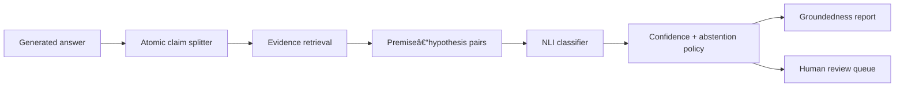

# VeriNLI — Explainable NLI Hallucination Verifier

An evidence-grounded Python system that decomposes generated answers into claims,
retrieves supporting passages, classifies each claim as **entailment**,
**contradiction**, **neutral**, or **abstain**, and routes risky claims to human review.

The project targets two evaluation settings:

- general-domain factual verification;
- biomedical claim verification, building on biomedical NER and safe human–AI review.

## Why this project

Hallucination is not one binary property. A generated answer may contain supported,
unsupported, and contradictory claims simultaneously. VeriNLI produces an auditable
claim-level report instead of a single opaque score.

## Pipeline



## Current MVP

- deterministic atomic-claim decomposition;
- dependency-free lexical retrieval baseline;
- explainable offline NLI baseline;
- optional Hugging Face cross-encoder backend;
- dual confidence gates for retrieval and NLI;
- structured Pydantic reports;
- contradiction and abstention review routing;
- CLI and optional FastAPI service;
- adversarial fixtures for negation, numbers, time, and entity substitution;
- typed, linted, tested Python package with GitHub Actions CI.

The heuristic classifier is intentionally a transparent baseline, not the final
research model. It keeps tests offline and makes failure modes visible.

## Quick start

```bash
python -m venv .venv
# Windows: .venv\Scripts\activate
# Linux/macOS: source .venv/bin/activate
python -m pip install -e ".[dev]"
pytest

verinli verify \
  "BRCA1 pathogenic variants do not increase breast cancer risk." \
  examples/evidence.jsonl
```

API:

```bash
python -m pip install -e ".[api]"
uvicorn verinli.api:app --reload
```

Open `http://127.0.0.1:8000/docs`.

## Report contract

Every claim verdict records:

- the atomic claim;
- selected evidence and source;
- retrieval score;
- NLI label and confidence;
- class probabilities;
- a human-readable rationale;
- human-review status and reasons.

The answer-level report includes groundedness, contradiction rate, label counts,
and whether any claim requires review.

## Evaluation plan

### General domain

- MultiNLI and ANLI for inference;
- FEVER-style evidence verification;
- adversarial negation, number, entity, and temporal transformations.

### Biomedical domain

- MedNLI for clinical inference;
- manually reviewed claims derived from public biomedical abstracts;
- entity-aware perturbations using disease, gene, drug, dose, and outcome swaps.

### Metrics

- macro F1 and per-label precision/recall;
- contradiction recall;
- expected calibration error and Brier score;
- risk–coverage curve for abstention;
- retrieval Recall@k and MRR;
- evidence-conditioned groundedness;
- human-review workload and unsafe false-negative rate.

Dataset downloads are deliberately not committed. Their original licences and
access conditions must be followed.

## Research roadmap

1. Add dataset adapters and a reproducible evaluation CLI.
2. Fit temperature scaling on a held-out calibration split.
3. Replace lexical retrieval with hybrid BM25 + dense retrieval and reranking.
4. Add biomedical entity linking and claim normalization.
5. Benchmark DeBERTa, ModernBERT, and instruction-tuned LLM judges.
6. Add adversarial dataset generation with semantic-validity checks.
7. Persist reviewer decisions and measure model–reviewer disagreement.
8. Add OpenTelemetry traces and a review dashboard.

## Safety

This software is a research and portfolio project. It is not a clinical decision
system. Biomedical outputs must be reviewed by qualified humans, and abstention
must not be interpreted as evidence that a claim is safe.

## License

MIT. Third-party models and datasets retain their own licences and terms.

