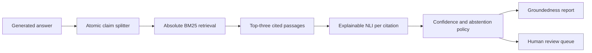

# VeriNLI - Explainable Hallucination Verification

[](https://github.com/Saroswat/explainable-nli-hallucination-verifier/actions/workflows/ci.yml)
[](https://www.python.org/downloads/)
[](LICENSE)
[](https://github.com/Saroswat/explainable-nli-hallucination-verifier)

VeriNLI checks an AI-generated answer against a supplied evidence corpus. It splits the
answer into claims, retrieves the strongest matching passage, classifies the relationship,
and explains which claims are supported, contradicted, uncertain, or require human review.

Everything runs locally. The default verifier does not send answers or evidence to an
external AI service.

## VeriNLI 0.3: Trustworthy Verification

- calibrated probability distributions that always sum to `1.0`;
- absolute BM25 relevance scores instead of best-match-relative scores;
- up to three independently labelled evidence citations per claim;
- explicit warnings when credible sources support conflicting verdicts;
- ordinary text, Markdown, JSONL, and CSV evidence input;
- downloadable JSON and CSV reports;
- adversarial coverage for negation, numbers, dosage, percentages, direction, time,
  entities, unsupported claims, and source disagreement.

## Run the local app on Windows

### Prerequisites

- [Git](https://git-scm.com/download/win)
- [Python 3.11 or newer](https://www.python.org/downloads/windows/)

When installing Python, enable **Add python.exe to PATH**.

### One-command launch

Open PowerShell and run:

```powershell
git clone https://github.com/Saroswat/explainable-nli-hallucination-verifier.git
cd explainable-nli-hallucination-verifier
.\run.ps1
```

### Install and launch from any folder

For a per-user installation in `%LOCALAPPDATA%\VeriNLI`, download the installer, inspect
it, and run it:

```powershell
$installer = Join-Path ([System.IO.Path]::GetTempPath()) "install-verinli.ps1"

Invoke-WebRequest `
    -Uri "https://raw.githubusercontent.com/Saroswat/explainable-nli-hallucination-verifier/main/install.ps1" `
    -OutFile $installer

Get-Content -LiteralPath $installer
powershell.exe -NoProfile -ExecutionPolicy Bypass -File $installer
```

The installer never changes the machine-wide PowerShell execution policy. It clones or
safely fast-forwards the expected GitHub repository, refuses to overwrite local changes,
and delegates dependency isolation to `run.ps1`.

Optional installer arguments:

```powershell
# Choose another installation folder and port
powershell.exe -NoProfile -ExecutionPolicy Bypass -File $installer `
    -InstallDirectory "D:\Apps\VeriNLI" `
    -Port 8080

# Download or update without starting the server
powershell.exe -NoProfile -ExecutionPolicy Bypass -File $installer -NoLaunch
```

If you are using Command Prompt instead, run `run.cmd` after entering the repository.
You can also double-click `run.cmd` in File Explorer.

The launcher automatically:

1. finds a compatible Python installation;
2. creates an isolated `.venv` environment;
3. installs the API and web-app dependencies;
4. starts VeriNLI only on `127.0.0.1`;
5. checks that the service is healthy;
6. opens [http://127.0.0.1:8000](http://127.0.0.1:8000) in your browser.

The first run downloads Python packages. Later launches reuse the environment and start
much faster. Press `Ctrl+C` in the launcher window to stop the server.

### Launcher options

```powershell
# Use another port
.\run.ps1 -Port 8080

# Start without opening a browser
.\run.ps1 -NoBrowser

# Reinstall dependencies
.\run.ps1 -Reinstall
```

## Using the workbench

1. Enter the answer or statement you want to inspect.
2. Paste ordinary evidence text, paste JSONL, or choose a supported evidence file.
3. Select **Verify claims**.
4. Review the groundedness score, claim verdicts, and ranked citations.
5. Export the complete report as JSON or CSV when needed.

Plain text and Markdown are automatically split at blank lines. The file picker accepts
`.txt`, `.md`, `.jsonl`, and `.csv` files. JSONL evidence needs `passage_id` and `text`;
`source` is optional:

```json
{"passage_id":"bio-001","text":"BRCA1 pathogenic variants increase breast cancer risk.","source":"example-guideline"}
{"passage_id":"bio-002","text":"Metformin is commonly used for type 2 diabetes.","source":"example-guideline"}
```

CSV evidence uses the same column names:

```csv
passage_id,text,source
bio-001,BRCA1 pathogenic variants increase breast cancer risk.,example-guideline
bio-002,Metformin is commonly used for type 2 diabetes.,example-guideline
```

The browser interface includes a safe sample so you can see the full workflow immediately.

## What the report means

| Verdict | Meaning | Human review |
| --- | --- | --- |
| `entailment` | The selected evidence supports the claim. | Usually not required |
| `contradiction` | Evidence conflicts through negation or numerical values. | Required |
| `neutral` | Evidence neither proves nor directly contradicts the claim. | Not automatically required |
| `abstain` | Retrieval relevance or NLI confidence is below the safety threshold. | Required |

Every claim verdict includes:

- the atomic claim;
- the selected evidence passage and source;
- up to three ranked evidence citations and their sources;
- absolute retrieval relevance and calibrated NLI confidence;
- class probabilities;
- a human-readable rationale;
- a warning when cited sources disagree;
- review status and reasons.

The answer-level report includes groundedness, contradiction rate, label counts, and an
overall review flag.

## How it works



The default NLI engine is a transparent, deterministic baseline. It is deliberately easy to
audit and works offline. The package also contains an optional Hugging Face transformer
backend for research experiments.

## API usage

While the local app is running:

- interactive API documentation: [http://127.0.0.1:8000/docs](http://127.0.0.1:8000/docs)
- health check: [http://127.0.0.1:8000/health](http://127.0.0.1:8000/health)
- verification endpoint: `POST http://127.0.0.1:8000/verify`
- CSV report endpoint: `POST http://127.0.0.1:8000/verify.csv`
- plain-text ingestion endpoint: `POST http://127.0.0.1:8000/ingest`

Example request:

```powershell
$body = @{
    answer = "Insulin regulates blood glucose."
    passages = @(
        @{
            passage_id = "bio-1"
            text = "Insulin regulates blood glucose."
            source = "demo"
        }
    )
} | ConvertTo-Json -Depth 4

Invoke-RestMethod `
    -Uri "http://127.0.0.1:8000/verify" `
    -Method Post `
    -ContentType "application/json" `
    -Body $body
```

## Command-line usage

After `run.ps1` has prepared the environment:

```powershell
.\.venv\Scripts\verinli.exe verify `
    "BRCA1 pathogenic variants do not increase breast cancer risk." `
    ".\examples\evidence.jsonl"
```

The evidence file can be JSONL, Markdown, or plain text. Export CSV directly with:

```powershell
.\.venv\Scripts\verinli.exe verify `
    "BRCA1 pathogenic variants increase breast cancer risk." `
    ".\examples\evidence.jsonl" `
    --format csv `
    --output ".\verinli-report.csv"
```

Without `--output`, the CLI prints the report for scripts and evaluation pipelines.

## Development

```powershell
python -m venv .venv
.\.venv\Scripts\Activate.ps1
python -m pip install -e ".[dev]"

ruff check .
mypy
pytest
```

CI runs linting, strict type checking, unit tests, API tests, and coverage on every push and
pull request.

### Project structure

```text
.
|-- run.ps1                 # One-command Windows launcher
|-- run.cmd                 # Command Prompt and double-click wrapper
|-- install.ps1             # Safe clone/update bootstrap for any folder
|-- examples/               # Sample evidence corpus
|-- evaluation/             # Adversarial evaluation fixtures
|-- src/verinli/
|   |-- api.py              # FastAPI and browser workbench
|   |-- claims.py           # Atomic claim decomposition
|   |-- ingestion.py        # Plain-text and JSONL evidence ingestion
|   |-- retrieval.py        # Evidence retrieval
|   |-- nli.py              # Heuristic and transformer backends
|   |-- calibration.py      # Confidence and abstention policy
|   |-- pipeline.py         # End-to-end orchestration
|   |-- reporting.py        # JSON and CSV report rendering
|   `-- web/index.html      # Dependency-free local interface
`-- tests/                  # Unit and API tests
```

## Troubleshooting

### PowerShell says scripts are disabled

Use the included Command Prompt wrapper:

```cmd
run.cmd
```

It changes the execution policy only for that launcher process and does not modify your
machine-wide PowerShell policy.

### Python is not found

Install Python 3.11+ and select **Add python.exe to PATH**, then open a new terminal. Check:

```powershell
python --version
```

### Port 8000 is already in use

```powershell
.\run.ps1 -Port 8080
```

### Dependencies changed or the environment is stale

```powershell
.\run.ps1 -Reinstall
```

## Limitations and safety

VeriNLI is a research and portfolio project, not a fact oracle or clinical decision system.
The BM25 retriever and heuristic NLI model are interpretable baselines and can miss
paraphrases, implicit facts, non-acronym entity substitutions, and complex reasoning. Treat an
`entailment` verdict as model output, not a guarantee of truth.

Biomedical outputs must be reviewed by qualified humans. An `abstain` result means the
system lacks confidence; it does not mean a claim is safe.

## Roadmap

- optional dense retrieval and cross-encoder reranking;
- calibrated transformer and biomedical NLI backends;
- dataset adapters and reproducible evaluation commands;
- biomedical entity linking and claim normalization;
- persisted reviewer decisions and disagreement metrics;
- observability and a dedicated review dashboard.

## License

[MIT](LICENSE). Third-party models and datasets retain their own licences and terms.
